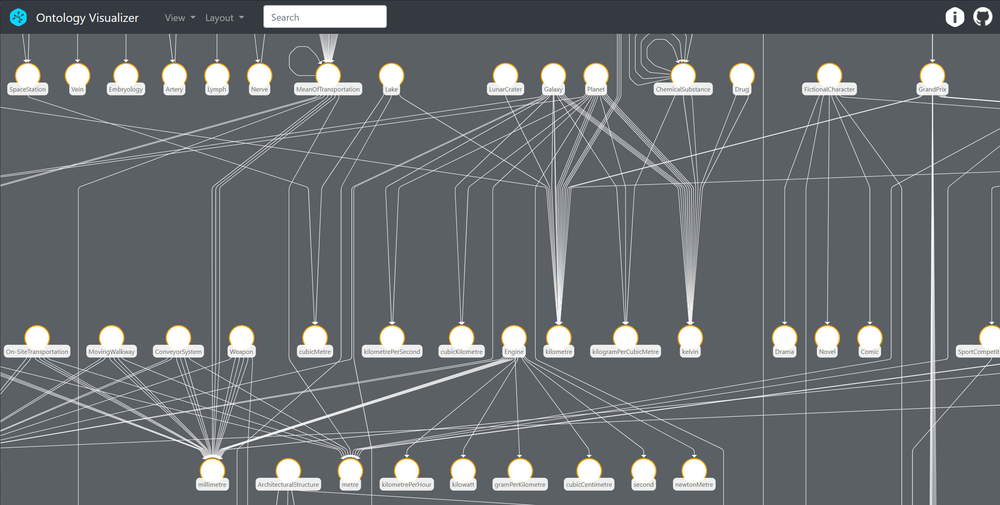

# Ontology Visualizer



This repository contains the sample application for the yFiles use case about
an [Ontology Visualizer](https://www.yworks.com/use-case/visualizing-an-ontology).
The app displays a sample ontology diagram that you can explore.


## See also

* [Watch the introductory video](https://player.vimeo.com/video/389490579) of this app
* [Read the article](https://www.yworks.com/use-case/visualizing-an-ontology) about an _Ontology Visualizer_
* [Learn more about yFiles](https://www.yworks.com/products/yfiles), the software library for visualizing, editing, and analyzing graphs

If you have any questions or suggestions, send us an email at [consulting@yworks.com](mailto:consulting@yworks.com)
or call [+49 7071 9709050](tel:+4970719709050).

## How to run this app

You need a copy of the [yFiles for HTML](https://www.yworks.com/products/yfiles-for-html) diagramming library in order
to run this application. You can download a free test version of yFiles in the
[yWorks Customer Center](https://my.yworks.com/signup?product=YFILES_HTML_EVAL).

Checkout this project, then extract the yFiles for HTML package to a directory next to it, e.g.:

```
documents
 |-- ontology-visualizer
 |-- yFiles-for-HTML-Complete-2.3.0.1-Evaluation
```

Afterwards, enter the `ontology-visualizer` directory and run the usual commands
```
npm i
```
followed by
```
npm start
```


## About

This application is powered by [yFiles for HTML](https://www.yworks.com/products/yfiles-for-html), the powerful
diagramming library.

Turn your data into clear diagrams with the help of unequaled automatic diagram layout, use rich visualizations for your
diagram elements, and give your users an intuitive interface for smooth interaction.

You can learn more about the many features that come with yFiles
on the [yFiles Features Overview](https://www.yworks.com/products/yfiles/features).

If you want to try it for yourself, obtain a free test version of yFiles in the
[yWorks Customer Center](https://my.yworks.com/signup?product=YFILES_HTML_EVAL).

## Contact

If you have any questions or suggestions, send us an email at [consulting@yworks.com](mailto:consulting@yworks.com)
or call [+49 7071 9709050](tel:+4970719709050).

## Data

The app shows data from [DBpedia](http://dbpedia.org/ontology/)

## License
The MIT License (MIT)

Copyright (c) 2020 yWorks GmbH

Permission is hereby granted, free of charge, to any person obtaining a copy of this software and associated documentation files (the "Software"), to deal in the Software without restriction, including without limitation the rights to use, copy, modify, merge, publish, distribute, sublicense, and/or sell copies of the Software, and to permit persons to whom the Software is furnished to do so, subject to the following conditions:

The above copyright notice and this permission notice shall be included in all copies or substantial portions of the Software.

THE SOFTWARE IS PROVIDED "AS IS", WITHOUT WARRANTY OF ANY KIND, EXPRESS OR IMPLIED, INCLUDING BUT NOT LIMITED TO THE WARRANTIES OF MERCHANTABILITY, FITNESS FOR A PARTICULAR PURPOSE AND NONINFRINGEMENT. IN NO EVENT SHALL THE AUTHORS OR COPYRIGHT HOLDERS BE LIABLE FOR ANY CLAIM, DAMAGES OR OTHER LIABILITY, WHETHER IN AN ACTION OF CONTRACT, TORT OR OTHERWISE, ARISING FROM, OUT OF OR IN CONNECTION WITH THE SOFTWARE OR THE USE OR OTHER DEALINGS IN THE SOFTWARE.
